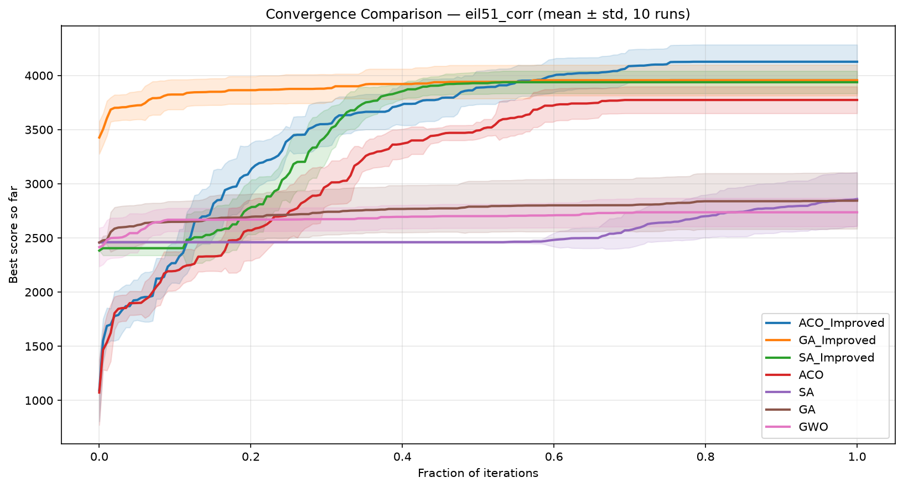
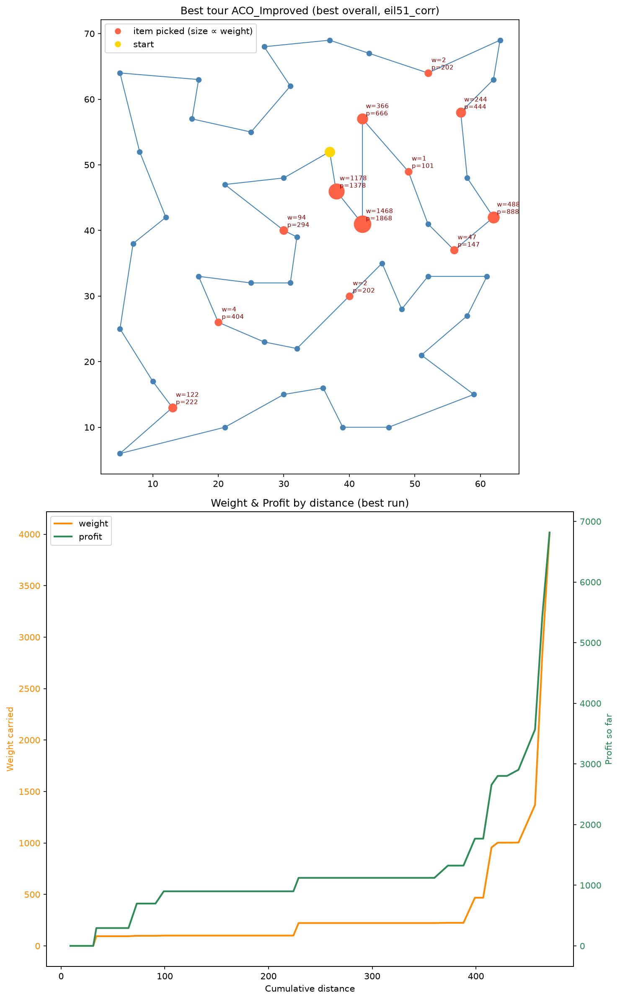

# Traveling Thief Problem - Metaheuristic Comparison

Comparative study of four metaheuristics (ACO, GWO, GA, SA) and their improved variants on the Traveling Thief Problem - an NP-hard problem where TSP routing and 0/1 Knapsack selection are combined through a shared objective.

**Tech focus:**  
Python 3 · NumPy · pandas · Matplotlib · Jupyter

**Algorithm focus:**  
Ant Colony Optimization (MMAS) · Grey Wolf Optimizer · Genetic Algorithm (EAX) · Simulated Annealing



## Problem

The Traveling Thief Problem couples two NP-hard subproblems with a non-linear interaction:

- **Tour** - visit all `n` cities exactly once (TSP)  
- **Packing** - select items from cities to carry home (0/1 Knapsack)

The coupling: picked-up items increase knapsack weight, which slows the thief, increasing renting cost. Solving each subproblem independently yields suboptimal TTP solutions. NP-hard (Bonyadi et al., 2013).

**Objective (maximize):**

```
f(tour, packing) = profit − renting_rate × total_time

speed(w) = v_max − (w / W) × (v_max − v_min)

total_time = Σ distance(city_i → city_{i+1}) / speed(weight_at_city_i)
```

Items are collected at each city en route, so weight (and therefore speed) is tour-order-dependent.

## Results

All tables come from [`results/all.csv`](results/all.csv) (`python main.py`: 1000 iterations, 10 runs per solver per instance).

**tiny7** (n=7, m=6), 10 runs. Brute force optimal = **115.23**.

| Algorithm | Best | Mean | Worst | Time (s) |
|---|---|---|---|---|
| Brute Force | 115.23 | n/a | n/a | 0.25 |
| ACO (MMAS) | 115.23 | 115.23 | 115.23 | 0.06 |
| ACO Improved | 115.23 | 115.23 | 115.23 | 0.06 |
| GA Improved | 115.23 | 115.23 | 115.23 | 0.03 |
| SA Improved | 115.23 | 115.23 | 115.23 | 0.26 |
| SA | 115.23 | 113.78 | 110.40 | 0.11 |
| GA | 115.23 | 112.53 | 108.95 | 0.27 |
| GWO | 115.23 | 84.63 | 54.85 | 0.03 |
| S5 | 65.78 | 65.78 | 65.78 | 0.00 |

ACO (MMAS), ACO Improved, GA Improved and SA Improved hit the optimum on every run. GWO has the widest spread (best 115.23, worst 54.85).

**eil51** (n=51, m=50, bounded-strongly-corr), 10 runs.

| Algorithm | Best | Mean | Worst | Time (s) |
|---|---|---|---|---|
| ACO Improved | 4269.21 | 4174.80 | 3953.90 | 19.11 |
| GA Improved | 4229.86 | 3872.61 | 3663.72 | 0.88 |
| SA Improved | 4071.62 | 3884.68 | 3578.19 | 10.26 |
| ACO (MMAS) | 3874.41 | 3709.46 | 3545.06 | 12.65 |
| GA | 3810.06 | 2961.64 | 2534.88 | 1.40 |
| SA | 3309.23 | 2847.39 | 2457.66 | 0.27 |
| GWO | 2892.01 | 2798.28 | 2725.46 | 1.18 |
| S5 | 2575.12 | 2575.12 | 2575.12 | 0.00 |

ACO Improved scores highest here, with GA Improved close behind. ACO (MMAS) is the strongest of the un-improved algorithms, ahead of GA, GWO and SA. GWO and basic GA/SA fall well behind the Improved trio.

**Best solution found** (eil51, bounded-strongly-corr) - the route the thief actually walks, plus how much weight it's carrying and how much profit it's banked along the way:



Full results across all instances and algorithms: [`results/all.csv`](results/all.csv)  
Convergence plots, per-instance comparisons, and algorithm analysis: [`docs/notebook.ipynb`](docs/notebook.ipynb)  
Project documentation: [`docs/document.pdf`](docs/document.pdf) · Presentation: [`docs/presentation.pdf`](docs/presentation.pdf)

## Solvers

All solvers share a `BaseSolver` base class. Subclasses implement `_initialize()`, `_iterate()`, and `_finalize()`; stagnation-based early stopping is built into the solve loop.

| Shared method | Description |
|---|---|
| `_greedy_packing` | Tour-aware greedy packing, scores items by `profit / (weight × remaining_distance)` |
| `_pack_iterative` | Multi-pass bit-flip local search on the packing vector |
| `_two_opt_full` | 2-opt evaluating the full TTP objective, not just tour distance - a cheap distance-only check skips candidates that can't shorten the tour before paying for the full evaluation |
| `_or_opt_full` | OR-opt with segments of length 1 and 2, same cheap distance pre-filter as `_two_opt_full` before the full evaluation |

### Brute Force

Exhaustive search over all `(n-1)! × 2^m` combinations. Guarantees the optimal solution; only feasible on tiny instances (tiny7: 720 × 64 = 46,080 evaluations). Used as the reference ceiling.

### S5 - Greedy Baseline

Deterministic, no iterations. Nearest-neighbor tour → greedy packing by `profit / (weight × remaining_distance)` → iterative bit-flip to local optimum. Serves as a lower reference point.

### ACO - Ant Colony Optimization

MMAS (Max-Min Ant System) variant with pheromone bounds recalculated on each improvement, stagnation recovery, and a deposit schedule that transitions from exploration to exploitation mid-run.

| Feature | Design decision |
|---|---|
| **τ bounds** | τ_max, τ_min derived from best tour cost each improvement - prevents edge dominance and path starvation |
| **Deposit schedule** | Iteration-best for first 50% of iterations, global-best for second half - broadens early exploration, sharpens late convergence |
| **Stagnation reset** | After 100 iterations without improvement, τ reset uniformly to τ_max |
| **η (heuristic)** | Inverse edge distance `1/d(i,j)` - standard attractiveness, independent of packing |
| **Local search** | 1-pass 2-opt on tour + 3-pass iterative bit-flip on packing, applied to iteration-best ant only |

### ACO (Improved) - Adaptive Evaporation Control

| Feature | Design decision |
|---|---|
| **τ bounds seeding** | Random reference tour instead of greedy - a greedy tour's cost is already close to optimal, a poor "how bad can it get" baseline for τ_max |
| **Evaporation rate** | Reacts to the stagnation counter instead of staying fixed - grows up to 3x the base rate at full stagnation, clearing pheromone faster to push exploration |
| **Deposit schedule** | Switches to global-best once stagnation passes 50% of the limit, instead of a fixed iteration count - reacts to whether the search is actually stuck |

### GWO - Grey Wolf Optimizer

Discrete adaptation of GWO for combined permutation (tour) + binary (packing) solution spaces.

| Feature | Design decision |
|---|---|
| **Pack seeding** | Top 10% of wolves initialized with perturbed greedy tour (random 2-opt reversal) + greedy packing |
| **`a` schedule** | Linearly decays `2 → 0` over iterations - high exploration early, convergence pressure late |
| **Tour movement** | Swap-sequence decomposition: minimal `(i, j)` swap list from wolf to each guide; `1 − \|A\|` fraction applied; `\|A\| ≥ 1` triggers random 2-opt instead |
| **Packing movement** | Bit-copy probability = `max(0, 1 − \|A\|)` toward each guide independently |
| **Majority vote** | Final packing = majority of α/β/δ guide packings per bit; capacity-repair removes lowest-value items if overloaded |

### GA - Genetic Algorithm

| Feature | Design decision |
|---|---|
| **Selection** | Tournament selection (k=3), population of 50 |
| **Tour crossover** | Order crossover (OX) - preserves relative city order from both parents |
| **Packing crossover** | Uniform crossover - each bit independently inherited from either parent |
| **Elitism** | Best individual carried to next generation unchanged |
| **Mutation** | 2-opt reversal for tour; single bit-flip for packing; capacity repair if violated |

### GA (Improved) - Edge Assembly Crossover

| Feature | Design decision |
|---|---|
| **Tour crossover** | EAX (Edge Assembly Crossover) - detects AB-cycles between parent edge sets, merges subtours by minimum distance delta |
| **Initialization** | Every individual seeded from NN tour (different start city) + 2-opt + iterative packing |
| **Local search** | 2-opt + OR-opt applied to every offspring before evaluation |
| **Packing** | Greedy init on offspring tour + multi-pass iterative bit-flip refinement |
| **Replacement** | Steady-state (population of 30): offspring replaces worst only if strictly better |

### SA - Simulated Annealing

| Feature | Design decision |
|---|---|
| **Move types** | 2-opt reversal (p=0.4), city reinsertion (p=0.3), packing-only step (p=0.3); bit-flip applied independently at p=0.4 |
| **Acceptance** | Metropolis criterion: accept worsening move with `exp(Δ/T)` |
| **Cooling** | Geometric: `T ← T × 0.9995` |
| **Capacity** | Bit-flip rejected at move time if it violates capacity - no repair needed |

### SA (Improved) - Adaptive Simulated Annealing

| Feature | Design decision |
|---|---|
| **T₀ calibration** | Sample 200 random bit-flip Δ values from initial solution; set T₀ so `P(accept worsening) ≈ 0.8` - scales automatically per instance |
| **Warm start** | Greedy tour → 2-opt → OR-opt → iterative packing before first iteration |
| **Batch moves** | `n/2` tour proposals (greedy accept) + `m/2` packing flips (SA acceptance) per cooling step |

## Failure Modes and Recovery

**Pheromone stagnation (ACO):** Trails converge prematurely, locking the colony into a suboptimal route. After 100 iterations without score improvement, pheromone levels reset to τ_max.

**Constraint violation (GA, GA Improved):** OX crossover preserves tour validity but packing crossover can violate knapsack capacity. Capacity repair removes items in ascending `profit/weight` order until the constraint is satisfied.

**High variance (GWO):** widest spread of any solver (best 115.23, worst 54.85 on tiny7). GWO is built for continuous problems, and we adapted it for a discrete one here - a rougher fit than the other solvers' purpose-built discrete operators.

**Cold-start inefficiency:** SA Improved auto-calibrates T₀ from sampled deltas rather than guessing; GA Improved seeds every individual with a greedy + local-search solution rather than random permutations.

## Benchmark Instances

| Instance | Cities | Items | Correlation |
|---|---|---|---|
| tiny_n5 | 5 | 4 | - |
| tiny_n7 | 7 | 6 | - |
| tiny_n9 | 9 | 8 | - |
| eil51 | 51 | 50 | uncorrelated |
| eil51 | 51 | 50 | bounded-strongly-corr |
| pr76 | 76 | 75 | uncorrelated |
| pr76 | 76 | 75 | bounded-strongly-corr |
| rat195 | 195 | 194 | uncorrelated |
| rat195 | 195 | 194 | bounded-strongly-corr |

## Architecture

```
core/
  ttp_instance.py       # cities, items, distances, capacity, renting rate
  ttp_loader.py         # .ttp file parser
  ttp_evaluator.py      # objective function; evaluate_traced for animation
  ttp_solution.py       # (tour, packing) container

solvers/
  base_solver.py        # shared: greedy tour/packing, 2-opt, OR-opt,
                        #         OX crossover, iterative bit-flip, capacity repair
  aco_solver.py
  aco_improved_solver.py
  gwo_solver.py
  ga_solver.py
  ga_improved_solver.py
  sa_solver.py
  sa_improved_solver.py
  s5_solver.py          # greedy construction baseline

visuals/
  convergence.py        # convergence curves (per run, and mean ± std comparison)
  tour_map.py           # tour + weight/profit plots
  animations.py         # pheromone, tour, and weight/profit animations

docs/
  notebook.ipynb        # full analysis: score tables, convergence plots, comparison
  document.pdf / .tex
  presentation.pdf / .tex

benchmarks/             # .ttp instance files
results/                # all.csv, figures (convergence, best tour), GIFs
```

## Run

```bash
pip install -r requirements.txt
python main.py
```

Full analysis with plots and comparisons:
```bash
cd docs && jupyter notebook notebook.ipynb
```

## References

- Bonyadi, Michalewicz, Barone. *The Travelling Thief Problem*. IEEE CEC 2013.
- Polyakovskiy et al. *A Comprehensive Benchmark Set for TTP*. GECCO 2014.
- Stützle & Hoos. *MAX-MIN Ant System*. FGCS 2000.
- Mirjalili et al. *Grey Wolf Optimizer*. Advances in Engineering Software 2014.
- Kirkpatrick et al. *Optimization by Simulated Annealing*. Science 1983.

## Contributions

**My work:** ACO (MMAS) and ACO Improved, GWO; core problem representation (`TTPInstance`, loader, evaluator, solution); `BaseSolver` class design (solve loop, stagnation stopping, greedy tour and tour-aware packing helpers); convergence and pheromone animations, main benchmark runner, README.

**[@MatijaRadulovic](https://github.com/MatijaRadulovic):** 2-opt, OR-opt, iterative bit-flip methods in `BaseSolver`, Brute Force, S5, GA and GA Improved, SA and SA Improved.

`docs/notebook.ipynb` analysis, `docs/document.pdf`, and `docs/presentation.pdf` were done in collaboration.
